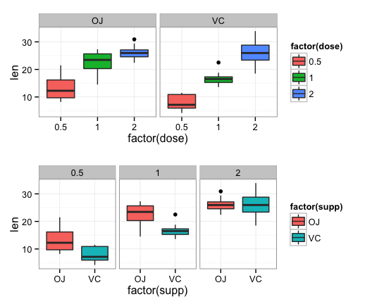

## Statistical Inference : ToothGrowth

#### Overview
In this project we will investigate the ToothGrowth Data set with techniques learnt in the Coursera Statistical Inference class. The ToothGrowth data set documents the effect of Vitamin C on tooth growth in Guinea Pigs. The response is the length of odontoblasts (teeth) in each of 10 guinea pigs at each of three dose levels of Vitamin C (0.5, 1, and 2 mg) with each of two delivery methods (orange juice or ascorbic acid).

#### Exploratory Data Analysis
* Plot

```r
library(ggplot2)
library(grid)
library(gridExtra)
g1 <- ggplot(ToothGrowth, aes(factor(dose), len)) + geom_boxplot((aes(fill = factor(dose)))) + facet_grid(. ~ supp) + theme_bw()
g2 <- ggplot(ToothGrowth, aes(factor(supp), len)) + geom_boxplot((aes(fill = factor(supp)))) + facet_grid(. ~ dose) + theme_bw()
grid.arrange(g1,g2,nrow=2)
```


Fig1 : As the top panel of plot indicates, there seems to be evidence of dose levels influencing the length of the tooth growth for a given delivery method. However the influence of delivery method for a given dose level is not so clear.

* Contingency Table

```r
table(ToothGrowth$supp,ToothGrowth$dose)
```

```
    
     0.5  1  2
  OJ  10 10 10
  VC  10 10 10
```
The total no of observations is 60

####  Basic Summary of Data

```r
library(plyr)
print(ddply(ToothGrowth,.(supp),summarize,mean=mean(len),sd=sd(len),n=length(len)),row.names=FALSE,justify="centre")
```

```
 supp     mean       sd  n
   OJ 20.66333 6.605561 30
   VC 16.96333 8.266029 30
```

```r
print(ddply(ToothGrowth,.(dose),summarize,mean=mean(len),sd=sd(len),n=length(len)),row.names=FALSE,justify="centre")
```

```
 dose   mean       sd  n
  0.5 10.605 4.499763 20
  1.0 19.735 4.415436 20
  2.0 26.100 3.774150 20
```
#### Confidence intervals and/or hypothesis tests to compare tooth growth by supp and dose.
- Hypothesis testing for difference of means by supp("Delivery Method : OJ,VC")

```r
tsupp <- t.test(len~supp,ToothGrowth)
tsupp
```

```
## 
## 	Welch Two Sample t-test
## 
## data:  len by supp
## t = 1.9153, df = 55.309, p-value = 0.06063
## alternative hypothesis: true difference in means is not equal to 0
## 95 percent confidence interval:
##  -0.1710156  7.5710156
## sample estimates:
## mean in group OJ mean in group VC 
##         20.66333         16.96333
```
###### Result : Since p = 0.06, we cannot reject the null hypothesis. 
- Hypothesis testing for difference of means by dose ("Dose Levels : 0.5,1,2")


```r
tdose0.51.0 <- t.test(len~dose,ToothGrowth,subset=((dose==0.5)|(dose==1)))
tdose1.02.0 <- t.test(len~dose,ToothGrowth,subset=((dose==1.0)|(dose==2.0)))
tdose2.00.5 <- t.test(len~dose,ToothGrowth,subset=((dose==2.0)|(dose==0.5)))
tdose0.51.0
```

```
## 
## 	Welch Two Sample t-test
## 
## data:  len by dose
## t = -6.4766, df = 37.986, p-value = 1.268e-07
## alternative hypothesis: true difference in means is not equal to 0
## 95 percent confidence interval:
##  -11.983781  -6.276219
## sample estimates:
## mean in group 0.5   mean in group 1 
##            10.605            19.735
```

```r
tdose1.02.0$p.value  ## P value of the t.test for Dose 1.0 and 2.0 mean comparison. For brevity just printed the p values.
```

```
## [1] 1.90643e-05
```

```r
tdose2.00.5$p.value  ## P value of the t.test for Dose 2.0 and 0.5 mean comparison. For brevity just printed the p values.
```

```
## [1] 4.397525e-14
```
###### Result : Based on the p values, we can reject the null hypothesis that the means are the same across the dose levels(0.5,1,2).

##### Conclusion & Assumption
###### Based on the hypothesis testing we can conclude that dose levels has effect on tooth growth. We also observe that increasing the dose levels increases the tooth growth. However supp(Delivery Method) has no effect on the tooth growth. The hypothesis testing results are valid under the assumption that a) observations are independent b) variance of the groups is not equal (var.equal=FALSE) c) The confidence level of the interval = 95%.d) Not a paired test (paired = FALSE)
