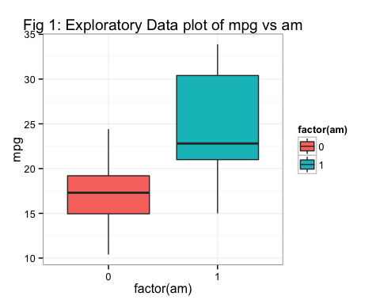
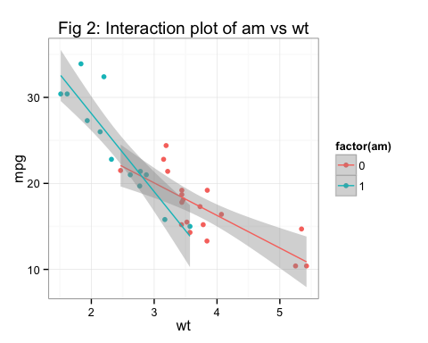
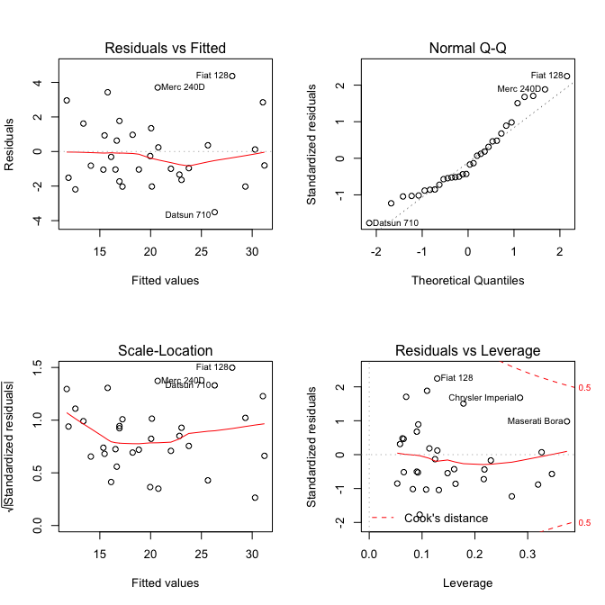

# Mtcars Analysis
courserans  
February 20, 2015  

### Executive summary

The "mtcars"" dataset was analysed using a combination of linear regression model and t.test to answer the 2 questions mentioned below. The mtcars dataset comprises of fuel consumption(mpg) and 10 aspects of automobile design and performance for 32 automobiles (1973–74 models). Based on the below analysis we conclude

* Manual transmission cars gives a **better** mpg than automatic transmission cars for lighter vehicles(wt < 3.4). For vehicles with wt > 3.4 automatic transmission vehicles provides better mpg. 
* The linear model mpg = 9.723 -2.936wt+1.017qsec+14.079am-4.141wt x am best models this dataset. This linear model implies that for a given qsec, a 1000 lb manual transmision car will provide **9.938 more** miles per gallon(mpg) than an automatic transmission car. However for a given qsec a 4000 lb manual transmission car will provide **2.485 less** mpg than an automatic transmission car. 

#### Q.1 “Is an automatic or manual transmission better for MPG”

**Fig1** (refer appendix) indicates that there is a perceptible difference in the means between an automatic and manual transmission car. Manual transmission car seems to have better mpg. We conduct a t.test hypothesis testing to identify if the difference in means is statistically significant.  

```r
amttest <- t.test(mpg~am,data=mtcars)
```
Based on the t.test we observe that difference in means of mpg between the automatic and manual transmission is **7.245** miles per gallon.Since the p value is **0.001** we reject the null hypothesis that the means are same. Based on the hypothesis testing we can conclude that the manual transmission is **better** than the automatic transmission for mpg.

#### Q.2. "Quantify the MPG difference between automatic and manual transmissions"

To quantify the mpg difference we fit a simple linear model, with mpg as the response and am as the predictor.


```r
fit <- lm(mpg ~ factor(am),data=mtcars)
summary(fit)$coeff
```

```
##              Estimate Std. Error   t value     Pr(>|t|)
## (Intercept) 17.147368   1.124603 15.247492 1.133983e-15
## factor(am)1  7.244939   1.764422  4.106127 2.850207e-04
```
We observe from the coefficients that mpg for automatic cars is **17.15** and that manual increases the mpg by **7.24**. However the R2 values is **0.36** which explains only **35.98 %** of the variance. Hence we must add additional predictor variables to arrive at a higher R2 and consequently a better fit.

##### Model selection

The model selection approach used in this analysis is backward selection strategy. As per this approach we start by fitting a linear model with all the response variables. Then identify the predictor variable with the largest p-value, refit a new model minus the variable with the largest p value, reassess for significance and adjusted R2 till we arrive at the most optimal model. 

```r
fit1 <- lm(mpg ~.,data=mtcars)
fit2 <- lm(mpg ~disp+hp+drat+wt+qsec+vs+am+gear+carb,data=mtcars) #cyl dropped
fit3 <- lm(mpg ~disp+hp+drat+wt+qsec+am+gear+carb,data=mtcars)    #vs  dropped
fit4 <- lm(mpg ~disp+hp+drat+wt+qsec+am+gear,data=mtcars)         #carb dropped
fit5 <- lm(mpg ~disp+hp+drat+wt+qsec+am,data=mtcars)              #gear dropped
fit6 <- lm(mpg ~disp+hp+wt+qsec+am,data=mtcars)                   #drat dropped
fit7 <- lm(mpg ~hp+wt+qsec+am,data=mtcars)                        #hp   dropped
fit8 <- lm(mpg ~wt+qsec+am,data=mtcars) 
```
All the predictor variables in the fit8 model are highly significant(Appendix). The adjusted R2 value is **0.85**. However **Fig2** (Appendix) indicates a possibility of interaction effect between am and the wt variable. A new linear model(fit9) with main effects (wt + qsec + am) and the interaction effect(am:wt) is constructed. We conduct a anova test between fit8 and fit9 models to identify if the effect of interaction is statistically significant.

```r
fit9 <- lm(mpg ~wt+qsec+am+am:wt,data=mtcars)
anova(fit8,fit9)$Pr[[2]]
```

```
## [1] 0.001808576
```
Based on the p value we can conclude that interaction effect is necessary. Hence we select fit9 : mpg ~wt+qsec+am+am:wt as the final model. This model has an adjusted R2 **0.896** and all the main effect and the interaction effect is significant. This linear model implies that for a given qsec a 1000 lb manual transmision car will provide **9.938 more** miles per gallon(mpg) than an automatic transmission car. However for a given qsec a 4000 lb manual transmission car will provide **2.485 less** mpg than an automatic transmission car. 

```r
summary(fit9)$coeff
```

```
##              Estimate Std. Error   t value     Pr(>|t|)
## (Intercept)  9.723053  5.8990407  1.648243 0.1108925394
## wt          -2.936531  0.6660253 -4.409038 0.0001488947
## qsec         1.016974  0.2520152  4.035366 0.0004030165
## am          14.079428  3.4352512  4.098515 0.0003408693
## wt:am       -4.141376  1.1968119 -3.460340 0.0018085763
```

##### Model Diagnostics
We observe that the residuals plot does not show any obvious pattern. The normal Q-Q plot the standardized residuals are on a line. One of the assumptions of the model is that error terms have a common variance. The scale location plot indicates the same. The standardized residual vs leverage plot also does not indicate any outlier points with significant effect or influence. Hence the applicability of a linear model to the dataset seems appropriate.

##### Appendix

* Exploratory Plots

```r
library(ggplot2)
ggplot(mtcars, aes(factor(am), mpg)) + geom_boxplot(aes(fill=factor(am))) + labs(title="Fig 1: Exploratory Data plot of mpg vs am") + theme_bw()
```



```r
g1 <- ggplot(data=mtcars, aes(x=wt, y=mpg, colour=factor(am))) + geom_point() + stat_smooth(method="lm") + labs(title="Fig 2: Interaction plot of am vs wt") + theme_bw()
g1
```


* Diagnostic Plots

```r
par(mfrow = c(2, 2))
plot(fit9)
```


* Test Summaries

```r
summary(fit8)
```

```
## 
## Call:
## lm(formula = mpg ~ wt + qsec + am, data = mtcars)
## 
## Residuals:
##     Min      1Q  Median      3Q     Max 
## -3.4811 -1.5555 -0.7257  1.4110  4.6610 
## 
## Coefficients:
##             Estimate Std. Error t value Pr(>|t|)    
## (Intercept)   9.6178     6.9596   1.382 0.177915    
## wt           -3.9165     0.7112  -5.507 6.95e-06 ***
## qsec          1.2259     0.2887   4.247 0.000216 ***
## am            2.9358     1.4109   2.081 0.046716 *  
## ---
## Signif. codes:  0 '***' 0.001 '**' 0.01 '*' 0.05 '.' 0.1 ' ' 1
## 
## Residual standard error: 2.459 on 28 degrees of freedom
## Multiple R-squared:  0.8497,	Adjusted R-squared:  0.8336 
## F-statistic: 52.75 on 3 and 28 DF,  p-value: 1.21e-11
```

```r
summary(fit9) #Final Model
```

```
## 
## Call:
## lm(formula = mpg ~ wt + qsec + am + am:wt, data = mtcars)
## 
## Residuals:
##     Min      1Q  Median      3Q     Max 
## -3.5076 -1.3801 -0.5588  1.0630  4.3684 
## 
## Coefficients:
##             Estimate Std. Error t value Pr(>|t|)    
## (Intercept)    9.723      5.899   1.648 0.110893    
## wt            -2.937      0.666  -4.409 0.000149 ***
## qsec           1.017      0.252   4.035 0.000403 ***
## am            14.079      3.435   4.099 0.000341 ***
## wt:am         -4.141      1.197  -3.460 0.001809 ** 
## ---
## Signif. codes:  0 '***' 0.001 '**' 0.01 '*' 0.05 '.' 0.1 ' ' 1
## 
## Residual standard error: 2.084 on 27 degrees of freedom
## Multiple R-squared:  0.8959,	Adjusted R-squared:  0.8804 
## F-statistic: 58.06 on 4 and 27 DF,  p-value: 7.168e-13
```
