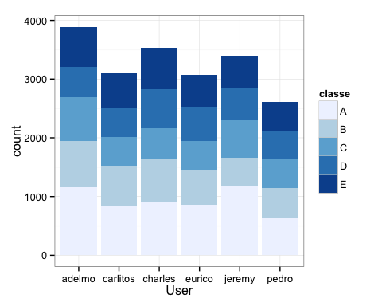
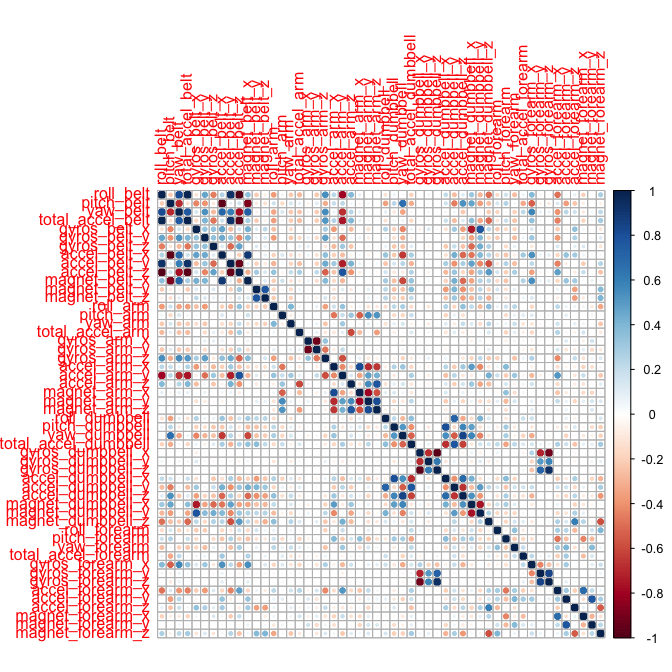
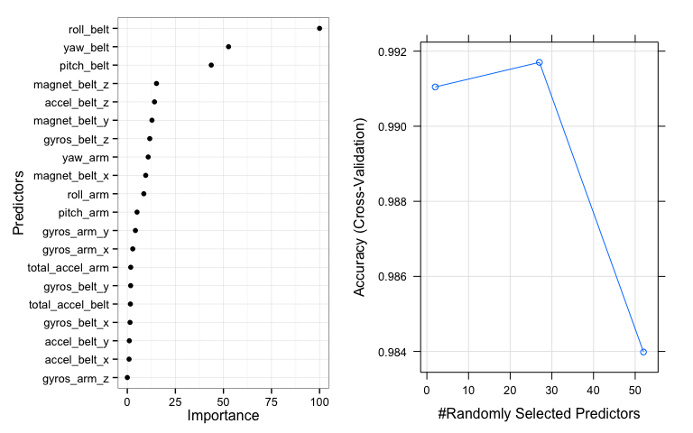

## Coursera Project - Practical Machine Learning

#### Background

The data set provided as part of the project exercise contains the accelerometer data for 6 participants who were asked to perform one set of 10 repetitions of the Unilateral Dumbbell Biceps Curl in five different manner. This is the "classe" variable in the training set.

- Class A : exactly according to the specification 
- Class B : throwing the elbows to the front
- Class C : lifting the dumbbell only halfway 
- Class D : lowering the dumbbell only halfway
- Class E : throwing the hips to the front

More information is available from the website here: http://groupware.les.inf.puc-rio.br/har (see the section on the Weight Lifting Exercise Dataset).

The goal of this project is to predict the manner in which a user did the exercise( Predict the "classe" variable). 

#### Load & Clean Data.


```r
library(caret)
```

```
## Loading required package: lattice
## Loading required package: ggplot2
```

```r
library(randomForest)
```

```
## randomForest 4.6-10
## Type rfNews() to see new features/changes/bug fixes.
```

1. Load Data


```r
# Training : https://d396qusza40orc.cloudfront.net/predmachlearn/pml-training.csv 
# Test : https://d396qusza40orc.cloudfront.net/predmachlearn/pml-testing.csv
test.raw <- read.csv("pml-testing.csv", na.strings=c("#DIV/0!","NA",""))
train.raw <-read.csv("pml-training.csv", na.strings=c("#DIV/0!","NA",""))
dim(train.raw)
```

```
## [1] 19622   160
```

2. Drop the rows with NA
3. Drop the first 7 columns which are user / observation specific markers and will not contribute to the prediction model.
4. Identify variables with zero variance so that predictor set can be reduced much further.

```r
predictors <- colnames(train.raw[colSums(is.na(train.raw)) == 0])[-(1:7)]
data <- train.raw[predictors]
nearZeroVar(data)
```

```
## integer(0)
```

```r
dim(data) ## 1 of the columns is classe and needs to be subtracted to arrive at the predictors.
```

```
## [1] 19622    53
```
As we note the predictor set has been reduced from **160** to **52**. Also the output of the nearZeroVar is zero which indicates that all the predictors have a non zero variance.

#### Exploratory Data Analysis

- Fig 1 from appendix : The user plot by classe indicates that there are 6 users and all of them have sufficient number of observation for each classe. 
- Fig 2 from appendix : The correlation plot indicates a number of variables with high correlations. We will not be removing these high correlation variables from the predictor, but instead allow the RF model to identify the most optimal predictor set.


#### Model Building
1. Create a test and training set
2. Fit a RF model with 5 fold cross validation

```r
set.seed(1021)
inTrain <- createDataPartition(y=data$classe, p=0.7, list=FALSE)
training <- data[inTrain,]
testing <- data[-inTrain,]

model <- train(classe ~ ., data=training, method="rf",
               trControl=trainControl(method="cv", 5))
model$finalModel
```

```
## 
## Call:
##  randomForest(x = x, y = y, mtry = param$mtry) 
##                Type of random forest: classification
##                      Number of trees: 500
## No. of variables tried at each split: 27
## 
##         OOB estimate of  error rate: 0.62%
## Confusion matrix:
##      A    B    C    D    E class.error
## A 3901    3    1    0    1 0.001280082
## B   18 2632    8    0    0 0.009781791
## C    0   12 2379    5    0 0.007095159
## D    0    1   23 2227    1 0.011101243
## E    0    1    4    7 2513 0.004752475
```

#### Model Results

```r
hat.testing <- predict(model,testing)
accuracy <- round(confusionMatrix(testing$classe, hat.testing)$overall[1]*100,4)
error <- round((1 - as.numeric(confusionMatrix(testing$classe, hat.testing)$overall[1]))*100,4)
```
1. Fig 3 left panel of the plot lists the top 20 important features of the model. The roll_belt is the most important variable.
2. Mtry of 27 is the most optimal parameter for the model.
3. Accuracy of the model is **99.3033%** and the out of sample error is **0.6967**%

#### Prediction


```r
hat.predict <- predict(model,test.raw)
hat.predict
```

```
##  [1] B A B A A E D B A A B C B A E E A B B B
## Levels: A B C D E
```
The results were submitted to coursera as per code block 1 from appendix.

#### Appendix

Fig 1. User by Classe


```r
library(plyr)
library(ggplot2)
library(corrplot)
library(gridExtra)
```

```
## Loading required package: grid
```

```r
dat1 <- ddply(train.raw,.(classe,user_name),summarise,count=length(classe))
g1 <- ggplot(dat1,aes(x=factor(user_name),y=count, fill=classe)) + 
        geom_bar(stat="identity") + 
        scale_fill_brewer(palette=1) +
        xlab("User") + 
        theme_bw()
g1
```



Fig 2. Correlation plot


```r
corrplot(cor(data[,-53])) ## 53 is the classe variable
```



Fig 3. Model Results


```r
var.imp <- as.data.frame(varImp(model)$importance)
var.imp$feature <- row.names(var.imp)
g2 <- ggplot(head(var.imp,20),aes(x=reorder(feature,Overall),y=Overall)) + 
    geom_point() + coord_flip() + 
    ylab("Importance") + xlab("Predictors")+
    theme_bw()
grid.arrange(g2,plot(model),ncol=2)
```



Code 1 : Submission code.

```r
# pml_write_files = function(x){
#     n = length(x)
#     for(i in 1:n){
#         filename = paste0("problem_id_",i,".txt")
#         write.table(x[i],file=filename,quote=FALSE,row.names=FALSE,col.names=FALSE)
#     }
# }
# pml_write_files(hat.predict)
```
